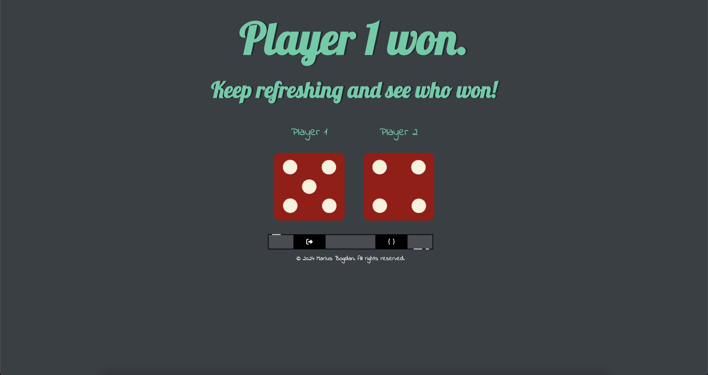

# Dice Game

[](#)

> A lightweight application that allows two players to roll dice by refreshing the page. The app generates random numbers for each player, determines the winner based on the dice roll.

## Overview
**Dice Game** is a simple and interactive web-based game where two players roll dice by refreshing the page. The app randomly generates a number for each player and determines the winner based on the highest roll. This project provides a fun way to understand basic JavaScript logic and DOM manipulation.

## Preview
<p align="center">
  
</p>

## Features
- **Two-Player Dice Roll:** Each player gets a randomly generated dice roll.
- **Winner Announcement:** Displays the winner based on the highest roll.
- **Randomized Outcomes:** Ensures fair gameplay with unpredictable results.

## Live Demo
**Explore the live version here:** [View Live Demo](https://marius-bogdan.com/projects/dice-game/)

## Local Setup
1. **Clone** the repository:
   ```bash
   git clone https://github.com/MIBogdan/dice-game.git
   ```
2. **Open** the `index.html` file in your browser
   *- or use a local development server (like VS Code Live Server) for a smoother development experience.*

---

## Author
**Marius Bogdan**  
[Personal portfolio](https://marius-bogdan.com/)

Feel free to reach out for any questions or collaborations!

## License

This project is provided for testing and demonstration purposes only. All rights are reserved. No part of this project may be redistributed, reuploaded, or used in any manner (commercially or otherwise) without explicit written permission from the author.
